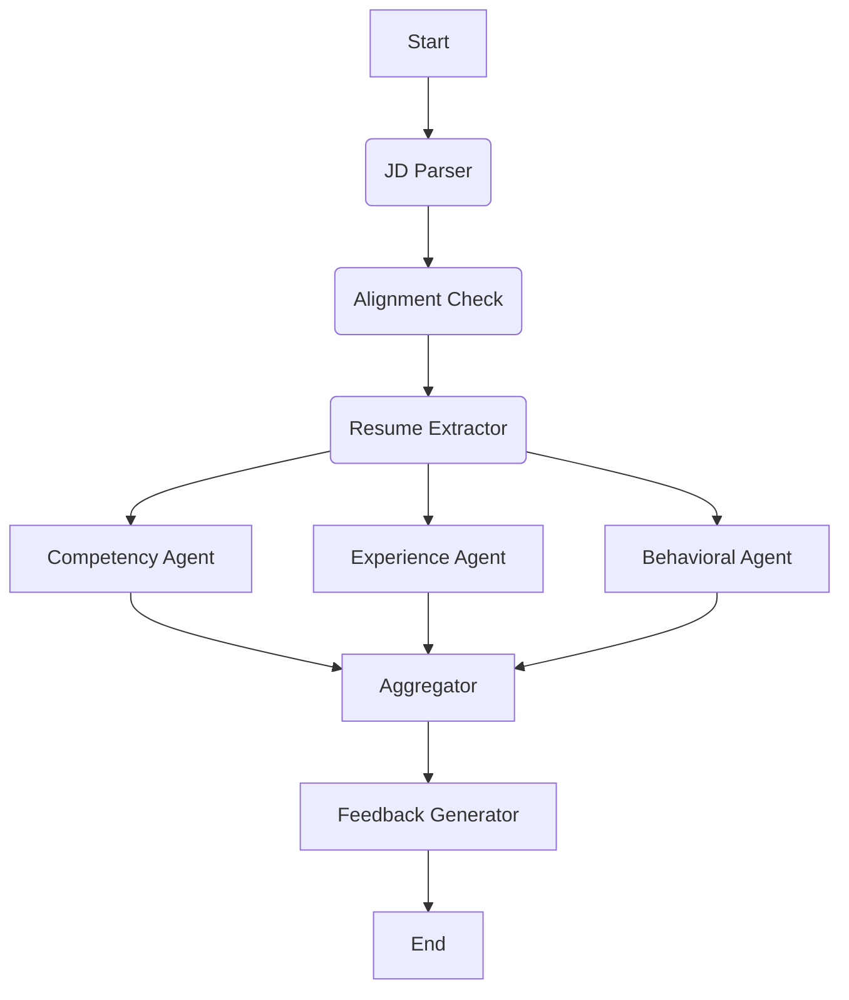

# TalentScan AI Backend


---

AI-powered resume evaluator built with **FastAPI** and **LangGraph**.
It analyzes candidate resumes against job descriptions and produces structured fit scores, skill gap analysis, strength and weakness insights, interview question recommendations, and personalized candidate feedback emails.
The system uses a multi-agent workflow where each agent evaluates a different dimension of candidate fit, then aggregates results into a final score with a candidate feedback generation step.

---

## Table Of Contents
- [Architecture](#architecture-overview)
- [Quick Start](#quick-start)
- [API Endpoints](#api-endpoints)
- [Project Structure](#project-structure)
- [Processing Pipeline](#processing-pipeline)
- [Key Features](#key-features)
- [Deployment](#docker-deployment)
- [Dependencies](#dependencies)

---

## Architecture Overview
The evaluation runs as a LangGraph workflow pipeline with retry policies and in-memory checkpointing.



Each stage produces structured JSON output that is passed forward via LangGraph state.

---

## Quick Start
### Prerequisites.
- Python 3.10 or newer.
- Groq API key.

### Installation
```bash
cd AI_Backend
```

```bash
pip install -r requirements.txt
```

### Environment Variables
Create a `.env` file:
```env
GROQ_API_KEY=your_groq_api_key
LANGCHAIN_TRACING_V2=true
LANGCHAIN_ENDPOINT=https://api.smith.langchain.com
LANGCHAIN_API_KEY=
LANGCHAIN_PROJECT=
```

### Run the server
```bash
uvicorn main:app --reload
```

---

## API Endpoints

### `POST /analyze/graph`
Main evaluation endpoint. Accepts resume file or raw text for parsed LinkedIn profiles.

**Request (Form Data):**
| Field           | Type   | Required | Description          |
| --------------- | ------ | -------- | -------------------- |
| file            | File   | No       | Resume PDF or DOCX   |
| raw_text        | String | No       | Resume as plain text |
| job_description | String | Yes      | Full JD text         |
| role_name       | String | Yes      | Target role title    |

**Rate Limit:** 5 requests per minute per IP.

**Response (JSON):**
```json
{
  "success": boolean,
  "role": string,
  "final_score": number,
  "recommendation": "Shortlist | Maybe | Reject",
  "summary": {
    "final_score": number,
    "final_reasoning": string,
    "category_scores": {
      "competency": number,
      "experience": number,
      "soft_skills": number
    },
    "jurisdiction_flag": boolean,
    "strengths": [ string ],
    "weaknesses": [ string ],
    "interview_questions": [ string ]
  },
  "agent_reports": {
    "competency_agent": {
      "inferred_job_family": string,
      "jd_role_mismatch": boolean,
      "jd_is_vague": boolean,
      "use_market_standards": boolean,
      "jurisdiction_issue": boolean,
      "critical_success_factors": [ string ],
      "score": number,
      "reasoning": string,
      "matched_competencies": [ string ],
      "missing_competencies": [ string ]
    },
    "experience_agent": {
      "jd_role_mismatch": boolean,
      "jd_is_vague": boolean,
      "use_market_standards": boolean,
      "score": number,
      "reasoning": string,
      "relevant_years_validated": number,
      "education_adjustment_applied": boolean,
      "red_flags": [ string ]
    },
    "behavioral_agent": {
      "jd_role_mismatch": boolean,
      "jd_is_vague": boolean,
      "use_market_standards": boolean,
      "score": number,
      "reasoning": string,
      "soft_skills_detected": [ string ],
      "missing_role_skills": [ string ]
    }
  },
  "parsed_profile": {
    "candidate_name": string,
    "first_name": string,
    "email": string,
    "email_valid": boolean,
    "phone_number": string,
    "current_position": string,
    "total_years_experience": number,
    "experience_level": "Entry | Mid | Senior",
    "skills": [ string ],
    "capability_evidence": [
      {
        "text": string,
        "source_section": string,
        "associated_role": string
      }
    ],
    "work_experience": [
      {
        "company": string,
        "job_title": string,
        "start_date": string,
        "end_date": string,
        "description": string
      }
    ],
    "education": [
      {
        "institution": string,
        "degree_level": string,
        "field_of_study": string,
        "year_graduated": number
      }
    ],
    "certifications": [ string ],
    "is_valid_resume": boolean,
    "extraction_confidence": {
      "email": number,
      "phone": number,
      "experience": number
    }
  },
  "candidate_feedback": {
    "recommendation": "Shortlist | Maybe | Reject",
    "feedback_email": {
      "subject": string,
      "body": string
    },
    "strengths": [ string ],
    "improvement_areas": [ string ]
  }
}
```

### `GET /`
Health check endpoint. Returns `{"status": "AI Agent System is Running"}`.

---

## Project Structure
```
AI_Backend/
├── main.py           # FastAPI app, API endpoint, file handling
├── graph.py          # LangGraph workflow definition, retry policies, checkpointing
├── nodes.py          # Agent node implementations (8 nodes)
├── prompts.py        # LLM prompt templates for each agent
├── states.py         # TypedDict state definitions with merge reducers
├── parsing.py        # PDF/DOCX text extraction and cleaning
├── requirements.txt  # Python dependencies
├── test.py           # Test suite
└── Dockerfile        # Docker containerization
```

---

## Processing Pipeline.
### 1. Job Description Parsing.
Extracts structured job requirements:
- Required years of experience.
- Primary skill requirements (atomic, matchable units).
- Education requirements (level and valid majors).
- Certification/licences needed.
- Role responsibilities.
- Falls back to inferred market standards if JD is sparse.

### 2. JD-Role Alignment Check.
Determines whether the JD matches the given role:
- Detects profession-level mismatches (e.g., nursing JD for a software role).
- Flags vague JDs (< 50 words or < 3 requirements).
- Preserves usable JD requirements (years, education) even on mismatch.
- Sets `use_market_standards` flag for downstream agents.
- Results are passed to all evaluation agents for consistency.

### 3. Resume Extraction.
Parses the resume into structured data:
- Candidate name, email (with validity check), and phone number.
- Work experience with dates and descriptions.
- Education history and certifications.
- Skills and capability evidence (action + tool + outcome).
- Independently calculates total years of experience from work dates.
- Extracts current position from most recent role.

### 4. Competency Evaluation.
Evaluates technical skills match:
- Compares candidate skills vs JD requirements using semantic matching.
- Handles acronyms, versions, and equivalent tools automatically.
- Considers education and certification equivalences.
- Identifies matched and missing competencies.
- Detects jurisdiction/licensing issues separately from skill gaps.
- Score recalculated from matched/missing arrays for consistency.
- Falls back to inferred market standards when JD is mismatched or vague.

### 5. Experience Evaluation.
Evaluates career history:
- Uses pre-calculated total years of experience.
- Assesses role relevance with career-changer and dual-title handling.
- Tracks career progression and domain continuity.
- Flags employment gaps or red flags.
- Supports preserved JD requirements in market standards mode.

### 6. Soft Skills Evaluation.
Evaluates behavioral fit:
- Identifies soft skills from explicit evidence (not inferred from tenure/title).
- Leadership and teamwork detection with few-shot examples.
- Matches against job responsibilities or inferred role standards.
- Detects missing soft skills.

### 7. Aggregation.
Combines all evaluations:
- Applies dynamic weighting based on JD signal density.
- Computes final weighted score using agent scores directly.
- Jurisdiction flag used for review only — no score penalty.
- Generates specific strengths, weaknesses, and interview questions.

### 8. Candidate Feedback.
Generates personalized candidate communication:
- Produces a professional feedback email using candidate's first name.
- Tone matched to score tier (Shortlist / Maybe / Reject).
- Provides recommendation category.
- Lists strengths and improvement areas constructively.

---

## Key Features
- **Multi-Agent Architecture** — Three parallel evaluation agents (Competency, Experience, Behavioral) for comprehensive assessment.
- **LangGraph Retry Policies** — Automatic retry (up to 3 attempts) on LLM failures for every node.
- **In-Memory Checkpointing** — LangGraph MemorySaver for state persistence during execution.
- **Semantic Skill Matching** — Case-insensitive, acronym-aware, version-agnostic skill comparison.
- **JD-Role Mismatch Detection** — Centralized alignment check prevents mis-evaluation when JD doesn't match the role.
- **Vague JD Handling** — Falls back to inferred market standards for incomplete job descriptions.
- **Score Recalculation** — Competency scores are verified against matched/missing arrays to prevent LLM hallucinated scores.
- **Jurisdiction-Aware Flagging** — Distinguishes licensing gaps from skill gaps without penalizing scores.
- **Candidate Feedback Generation** — Automated personalized email generation with tone matched to score tier.
- **Rate Limiting** — 5 requests/minute per IP via SlowAPI.
- **Pre-Calculated Experience** — Total years independently computed from work dates, not LLM-estimated.

---

## Docker Deployment

```bash
docker build -t talentscan-ai .
docker run -p 8000:8000 --env-file .env talentscan-ai
```

---

## Dependencies
| Package          | Purpose                        |
| ---------------- | ------------------------------ |
| fastapi          | API framework                  |
| uvicorn          | ASGI server                    |
| langchain        | LLM orchestration              |
| langchain-core   | Core LangChain abstractions    |
| langgraph        | Agent workflow graph           |
| langchain-groq   | Groq LLM integration           |
| langsmith        | LLM observability & tracing    |
| pypdf            | PDF text extraction            |
| mammoth          | DOCX text extraction           |
| slowapi          | Rate limiting                  |
| python-dotenv    | Environment variable loading   |
| python-multipart | Form data / file upload support|
| pydantic         | Data validation                |
| tiktoken         | Token counting                 |
| openai           | OpenAI SDK (transitive dep)    |
| numpy            | Numerical operations           |
| scikit-learn     | ML utilities                   |

---
