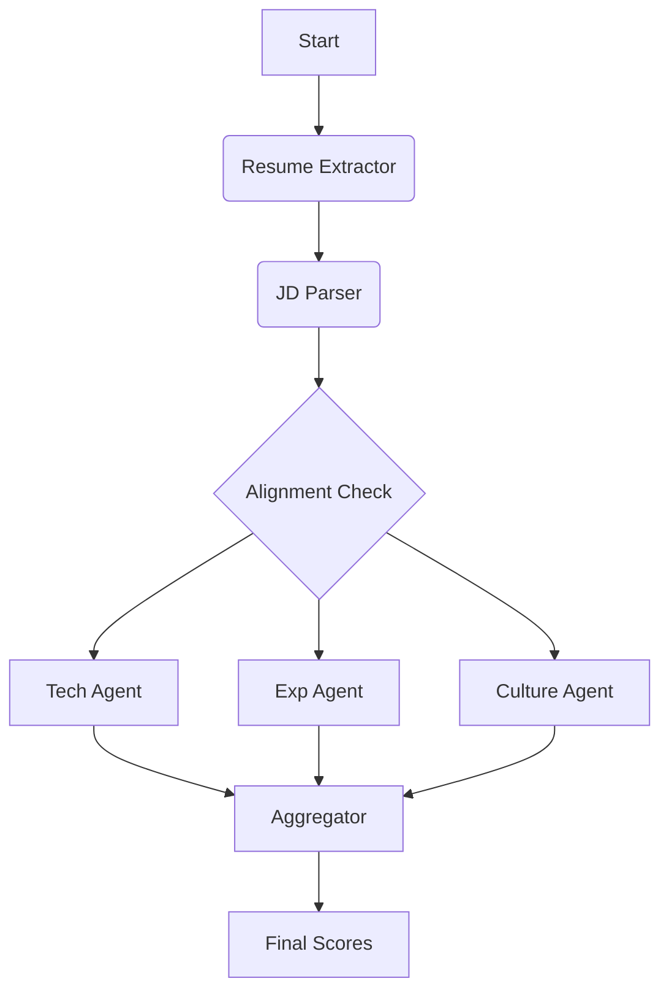

# TalentScan AI Backend


---

AI-powered resume evaluator build with **FastAPI** and **LangGraph**.
It analyzes candidate resumes against job descriptions and produces structured fit scores, skill gap analysis, strength and weakness insights, and interview questions recommendations.
The system uses multi-agent workflow where each agent evaluates a different dimension of candidate fit, then aggregates results into a final score.

---

## Table Of Contents
- [Architecture](#architecture-overview)
- [Quick Start](#quick-start)
- [API Endpoints](#api-endpoints)
- [Project Structure](#project-structure)
- [Processing Pipeline](#processing-pipeline)
- [Key Features](#key-features)
- [Deployment](#docker-deployment)
- [Dependencies](#dependecies)

---

## Architecture Overview
The evaluation runs as a Langgraph workflow pipeline.



Each stage produces structured output that is passed forward

---

## Quick Start
### Prerequisites.
- Python 3.10 or newer.
- OpenAI API key.

### Installation
```bash
cd AI_Backend
```

```bash
pip install -r requirements.txt
```

### Environment Variables
Create a `.env` file:
```env
OPENAI_API_KEY=your_openai_api_key
LANGCHAIN_TRACING_V2=true
LANGCHAIN_ENDPOINT=https://api.smith.langchain.com
LANGCHAIN_API_KEY=
LANGCHAIN_PROJECT=
```

### Run the server
```bash
uvicorn main:app --reload
```

---

## API Endpoints

### `POST /analyze/graph`
Main evaluation endpoint. Accepts resume file or raw text for parsed linkedin profiles.

**Request (Form Data):**
| Field           | Type   | Required | Description          |
| --------------- | ------ | -------- | -------------------- |
| file            | File   | No       | Resume PDF or DOCX   |
| raw_text        | String | No       | Resume as plain text |
| job_description | String | Yes      | Full JD text         |
| role_name       | String | Yes      | Target role title    |

**Response (JSON):**
```json
{
  "success": boolean,
  "role": string,
  "final_score": number,
  "summary": {
    "final_score": number,
    "final_reasoning": string,
    "category_scores": {
      "competency": number,
      "experience": number,
      "soft_skills": number
    },
    "strengths": [ string ],
    "weaknesses": [ string ],
    "interview_questions": [ string ]
  },
  "agent_reports": {
    "competency_agent": {
      "inferred_job_family": string,
      "jd_role_mismatch": boolean,
      "jurisdiction_issue": boolean,
      "critical_success_factors": [ string ],
      "score": number,
      "reasoning": string,
      "matched_competencies": [ string ],
      "missing_competencies": [ string ]
    },
    "experience_agent": {
      "jd_role_mismatch": boolean,
      "score": number,
      "reasoning": string,
      "relevant_years_validated": number,
      "education_adjustment_applied": boolean,
      "red_flags": [ string ]
    },
    "behavioral_agent": {
      "jd_role_mismatch": boolean,
      "score": number,
      "reasoning": string,
      "soft_skills_detected": [ string ],
      "missing_role_skills": [ string ]
    }
  },
  "parsed_profile": {
    "candidate_name": string,
    "total_years_experience": number,
    "skills": [ string ],
    "capability_evidence": [
      {
        "text": string,
        "source_section": string,
        "associated_role": string
      }
    ],
    "work_experience": [
      {
        "company": string,
        "job_title": string,
        "start_date": string,
        "end_date": string,
        "description": string
      }
    ],
    "education": [
      {
        "institution": string,
        "degree_level": string,
        "field_of_study": string,
        "year_graduated": number
      }
    ],
    "certifications": [ string ],
    "is_valid_resume": boolean
  }
}
```

### `GET /health`
Health check endpoint.

---

## Project Structure
```
AI_Backend/
├── main.py           # FastAPI app, API endpoints
├── graph.py          # langraph workflow definitions
├── nodes.py          # agent node implementations
├── prompts.py        # LLM prompts for each agent
├── states.py         # state definitions
├── parsing.py        # resume parsing logic
├── requirements.txt  # dependencies
└── Dockerfile        # containerization configuration
```

---

## Processing Pipeline.
### 1. Resume Extraction
Parses the resume into structured data:
- Candidate name and contact information
- Work experience with dates
- Education history
- Certifications
- Skills

### 2. Job Description Parsing.
Extracts job requirements:
- Required years of experience
- Primary skill requirements.
- Education requirements.
- Certification/licences needed.
- Role responsibilities.

### 3. JD-Role Alignment Check.
Check to determine whether the JD matches the given role:
- Prevents mis-evaluation when JD and job role doesn't match.
- Results are passed to all evaluation agents for consistency.

### 4. Competency Evaluation.
Evaluates technical skills match:
- Compares candidates skills vs JD requirements.
- Considers education and certification equivalences.
- Identifies missing competencies.
- Detects jurisdiction/licensing issues.

### 5. Experience Evaluation.
Evaluates career history:
- Calculates total years of experience.
- Assesses role relevance.
- Tracks career progression.
- Flags employment gaps or red flags.

### 6. Soft Skills Evaluation.
Evaluates behavioral fit:
- Identifies soft skills from evidence.
- Matches against job requirements/responsibilities.
- Detects missing soft skills

### 7. Aggregation.
Combines all evaluations:
- Applies dynamic weight based on JD.
- Computes final weighted score.
- Generates strengths, potential weaknesses and sample interview questions.

---

## Key Features


---

## Deployment


---

## Dependecies
| Package          | Purpose            |
| ---------------- | ------------------ |
| fastapi          | API framework      |
| uvicorn          | ASGI server        |
| langchain        | LLM orchestration  |
| langgraph        | Agent workflows    |
| langchain-openai | OpenAI integration |
| pypdf            | PDF parsing        |
| mammoth          | DOCX parsing       |
| slowapi          | Rate limiting      |
| python-dotenv    | Env loading        |

---

